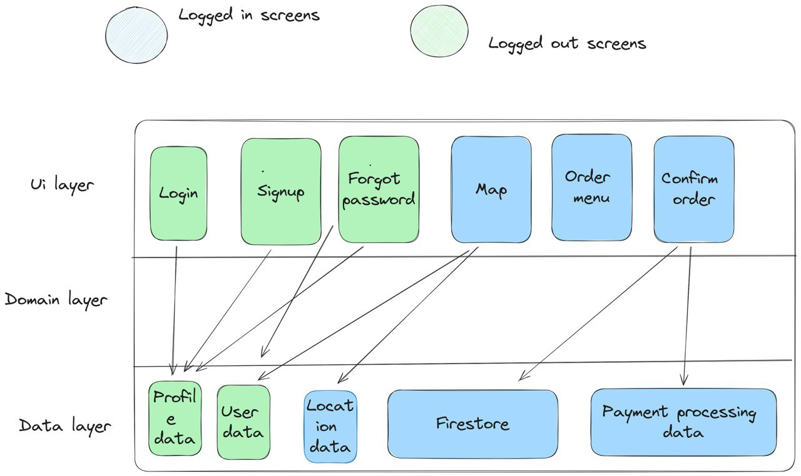

# Knight

[](https://codecov.io/gh/KnightDrone/Knight)

## Development Setup

1. Install Expo Go on your phone (you can download from the App Store or Google Play)
2. Install Node.js and NPM on your computer [here](https://nodejs.org/en/download/)
3. Install dependencies by running `npm install` in this directory
4. Start the development server by running `npm run start`
5. Use your phone to scan the QR code printed in the terminal
6. Enjoy! You can now see the app on your phone and make changes to the code in this directory to see them reflected in real time (save the file to see the changes).

> **Note:**  
> For macOS users, you can use XCode to run the app on the iOS simulator. To do this, run `npm run ios` instead of `npm run start` in step 4. Make sure you have XCode and the XCode CLI tools installed on your computer. To install XCode, download it from the App Store, then open the app and press `Command + ,` to open the preferences. Go to the Locations tab and install the CLI tools. See more information [here](https://docs.expo.dev/workflow/ios-simulator/).

> **Warning:**
> The app may not work as expected due to the folder structure. If you encounter any issues, please let me know. To fix the issue, you may need to update the code of the file `node_modules/expo/AppEntry.js` to the following: (the node_modules is generated after running `npm install`):
>
> ```javascript
> import registerRootComponent from "expo/build/launch/registerRootComponent";
> import App from "../../src/app/App"; // Change this line to the correct path
>
> registerRootComponent(App);
> ```

### Setup

To run the tests, execute the command `npm run test` in this directory. This will run the tests in the `__tests__` directory.  
To run the tests in watch mode, execute `npm run test:watch`. This will run the tests in the `__tests__` directory and watch for changes to the files. If you save a file, the tests will automatically run again.  
To run a specific test file, execute `npm run test <file-name>`. For example, to run the tests in `__tests__/App.test.js`, execute `npm run test App.test.js`.  
Additionally, you can run `npm run test:coverage` to view the test coverage of the app. The coverage report is available in the `coverage` directory, and `npm run test` also produces a coverage report.

### Writing Tests

To write tests, create a new file in the `__tests__` directory. Name the file after the file you want to test but append `.test.js` to the end. For example, to test `App.js`, create a file named `App.test.js`. Within this file, you can write tests using the Jest testing framework. Refer to the Jest documentation [here](https://jestjs.io/docs/getting-started) for guidance on how to write tests.  
For more information on how to test React components, consult the React Testing Library documentation [here](https://testing-library.com/docs/react-testing-library/intro/), with practical examples available [here](https://testing-library.com/docs/react-native-testing-library/example-intro).

### Navigation

For navigation we use the react-navigation library, which is setup in the App.tx file. To be able to access a different screen one must go to the RootStackParamList type and add the name of the Screen. If th e screen doesn't take any parameters then we write it as undefined. We then add it to the Stack Navigator. eg.

```javascript
<Stack.Screen name="ForgotPassword" component={ForgotPassword} />
```

Note: Don't forget to import the component to the App.tsx

For more information on how to use the react-navigation libray here are some links: -[React Navigation](https://reactnavigation.org/docs/getting-started) -[Using Typescript with React Navigation](https://react.dev/learn/typescript)

### Architecture Diagram


